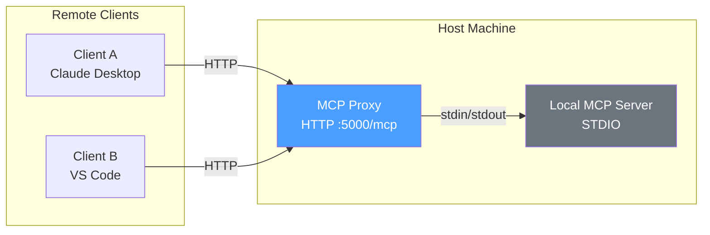
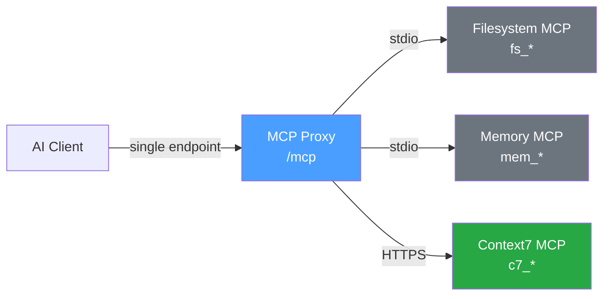
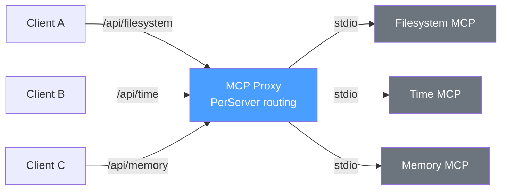
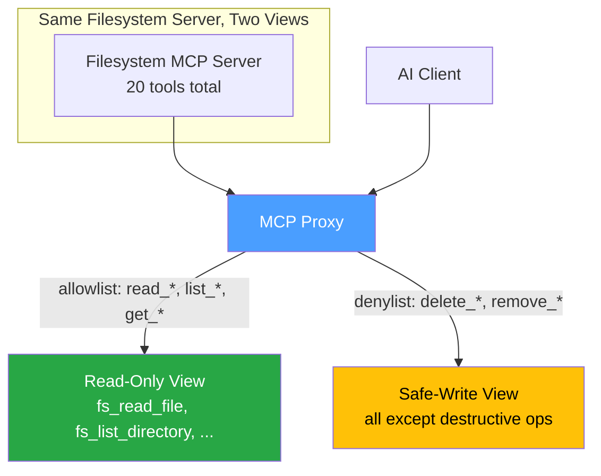
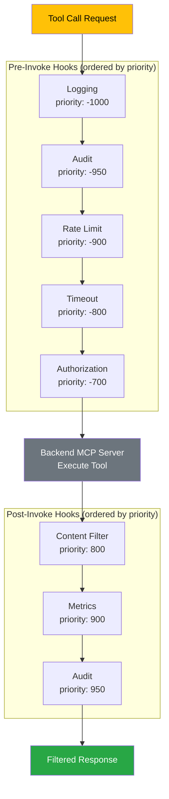
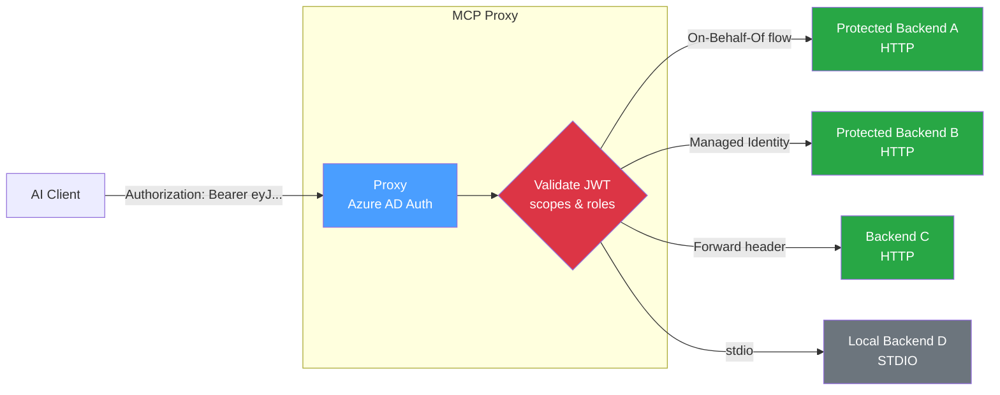
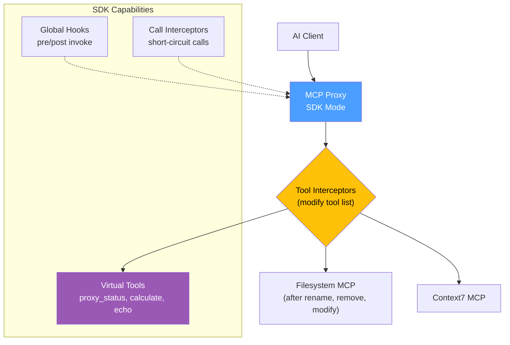
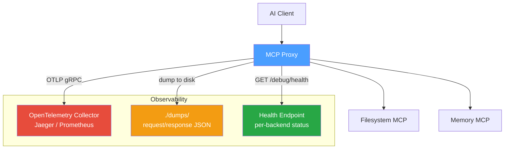
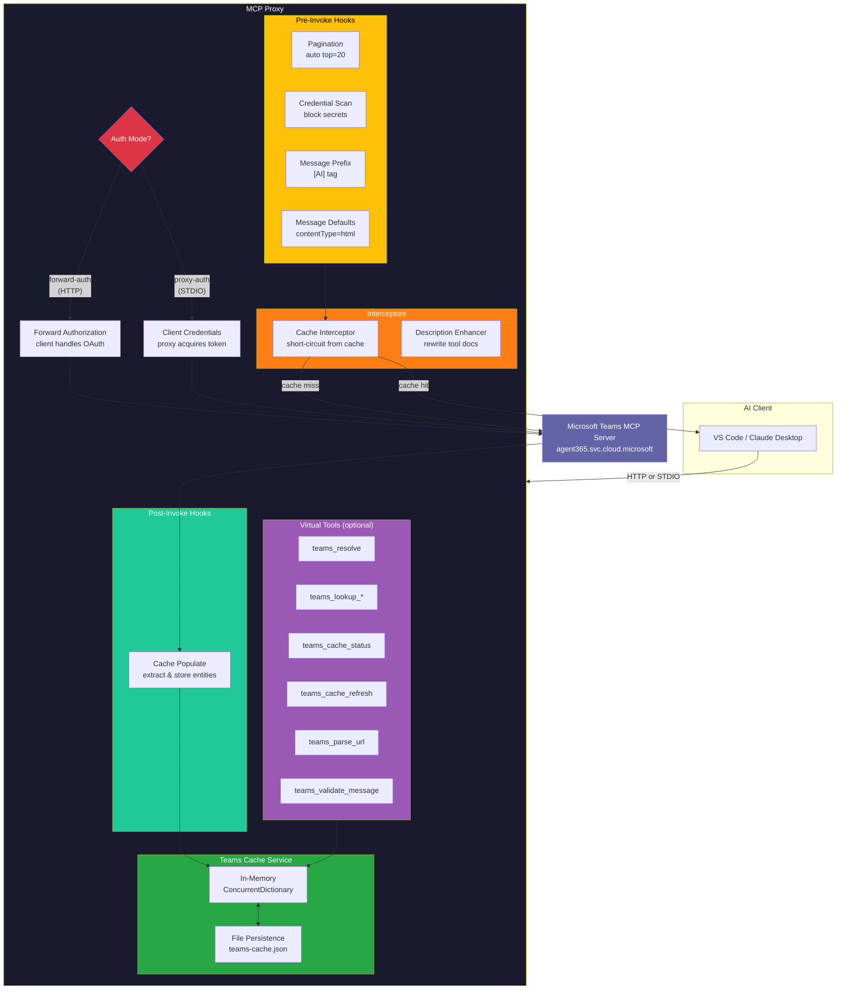

# Usage Scenarios

A visual guide to the different ways you can use MCP Proxy, from simple single-server setups to enterprise-scale architectures.

---

## 1. Local MCP Exposed as Remote

Turn any local STDIO-based MCP server into a remotely accessible HTTP endpoint. Useful when you want multiple clients or remote machines to reach a local tool.



```json
{
  "proxy": { "routing": { "mode": "unified", "basePath": "/mcp" } },
  "mcp": {
    "filesystem": {
      "type": "stdio",
      "command": "npx",
      "arguments": ["-y", "@anthropic/mcp-server-filesystem", "."]
    }
  }
}
```

Run with: `mcp-proxy --transport http --port 5000`

---

## 2. Remote MCP Exposed as Local

Wrap a remote HTTP/SSE-based MCP server behind a local STDIO interface. Useful when your client only supports STDIO but the server is remote.


```json
{
  "mcp": {
    "remote-api": {
      "type": "http",
      "url": "https://mcp.example.com/api",
      "headers": { "Authorization": "Bearer ${API_TOKEN}" }
    }
  }
}
```

Run with: `mcp-proxy --transport stdio`

---

## 3. Combining Multiple MCPs into One

Aggregate several backend MCP servers (local and remote) into a single unified endpoint. Tool prefixes prevent name collisions.



The client sees all tools from all three servers under one connection: `fs_read_file`, `mem_create_node`, `c7_resolve_library_id`, etc.

```json
{
  "mcp": {
    "filesystem": {
      "type": "stdio", "command": "npx",
      "arguments": ["-y", "@anthropic/mcp-server-filesystem", "."],
      "tools": { "prefix": "fs" }
    },
    "memory": {
      "type": "stdio", "command": "npx",
      "arguments": ["-y", "@anthropic/mcp-server-memory"],
      "tools": { "prefix": "mem" }
    },
    "context7": {
      "type": "http",
      "url": "https://mcp.context7.com/mcp",
      "tools": { "prefix": "c7" }
    }
  }
}
```

---

## 4. Per-Server Routing (Each MCP on Its Own URL)

Expose each backend on a dedicated HTTP path instead of aggregating everything. Each path behaves as an independent MCP endpoint.



Clients connect to only the servers they need. Each endpoint supports full MCP operations (`tools/list`, `tools/call`, etc.).

```json
{
  "proxy": {
    "routing": { "mode": "perServer", "basePath": "/api" }
  },
  "mcp": {
    "filesystem": { "type": "stdio", "command": "npx", "arguments": ["-y", "@anthropic/mcp-server-filesystem", "."] },
    "time":       { "type": "stdio", "command": "npx", "arguments": ["-y", "@anthropic/mcp-server-time"] },
    "memory":     { "type": "stdio", "command": "npx", "arguments": ["-y", "@anthropic/mcp-server-memory"] }
  }
}
```

---

## 5. Tool Filtering (Include / Exclude)

Control which tools are exposed per backend using allowlist, denylist, or regex filters. Expose the same server multiple times with different filters to create role-based views.



```json
{
  "mcp": {
    "filesystem-readonly": {
      "type": "stdio", "command": "npx",
      "arguments": ["-y", "@anthropic/mcp-server-filesystem", "."],
      "tools": {
        "prefix": "fs",
        "filter": { "mode": "allowlist", "patterns": ["read_*", "list_*", "get_*"] }
      }
    },
    "filesystem-safe": {
      "type": "stdio", "command": "npx",
      "arguments": ["-y", "@anthropic/mcp-server-filesystem", "."],
      "tools": {
        "prefix": "fsw",
        "filter": { "mode": "denylist", "patterns": ["delete_*", "remove_*", "clear_*"] }
      }
    }
  }
}
```

---

## 6. Hooks Pipeline

Hooks intercept tool calls before and after execution. Chain multiple hooks with priority ordering for logging, auth, rate limiting, content filtering, and more.



Hooks can block requests (authorization), modify inputs (input transform), modify outputs (content filter, PII redaction), or observe (logging, metrics, audit).

```json
{
  "hooks": {
    "preInvoke": [
      { "type": "logging",       "config": { "logArguments": true } },
      { "type": "rateLimit",     "config": { "maxRequests": 100, "windowSeconds": 60 } },
      { "type": "authorization", "config": { "allowedTools": ["read_file", "list_directory"] } }
    ],
    "postInvoke": [
      { "type": "contentFilter", "config": { "patterns": ["password", "api[_-]?key"], "action": "redact" } }
    ]
  }
}
```

---

## 7. Authentication and Backend Auth

Secure the proxy endpoint and authenticate to protected backends using different credential flows.



The proxy validates incoming requests and uses separate credential flows per backend -- client credentials, on-behalf-of, managed identity, or simple header forwarding.

---

## 8. SDK: Virtual Tools and Interceptors

Using the programmatic SDK, you can add custom tools that run inside the proxy (no backend needed), intercept tool lists, and modify tool calls on the fly.



```csharp
builder.Services.AddMcpProxy(proxy =>
{
    proxy.AddTool("proxy_status", "Get proxy health", (req, ct) => ...);
    proxy.RenameTool("fs_read_file", "read");
    proxy.RemoveToolsByPattern("*_deprecated");
    proxy.InterceptTools(tools => tools.Where(t => !t.Tool.Name.Contains("dangerous")));
});
```

---

## 9. Telemetry and Debugging

Export metrics and traces via OpenTelemetry, dump request/response payloads, and expose a health endpoint for monitoring.



---

## 10. Teams Integration (Sample 15) -- Full Architecture

The most advanced scenario: a complete Microsoft Teams MCP Server integration with caching, credential scanning, enhanced descriptions, virtual tools, and two authentication modes.



### How it works

1. **Request arrives** -- authenticated via forward-auth (browser OAuth) or proxy-auth (client credentials).
2. **Pre-invoke hooks fire** -- auto-paginate list calls, scan messages for leaked credentials, optionally prefix messages with `[AI]`, set `contentType=html` on messages.
3. **Cache interceptor** checks if fresh data exists for list/get operations -- returns cached data immediately if available, skipping the network call entirely.
4. **Tool description interceptor** rewrites all Teams tool descriptions with enhanced context about proxy capabilities (caching, pagination, credential scanning).
5. **Backend call** goes to the Microsoft Teams MCP Server (with the appropriate auth token).
6. **Post-invoke cache populate hook** parses responses from list/get operations and extracts people, chats, teams, and channels into the in-memory cache (persisted to disk).
7. **Virtual tools** (optional) provide direct cache access: resolve names, look up entities, check cache health, parse Teams URLs, and validate messages before sending.

### Config snippet

```json
{
  "proxy": {
    "serverInfo": { "name": "Teams Integration", "version": "1.0.0" }
  },
  "mcp": {
    "teams": {
      "type": "sse",
      "url": "https://agent365.svc.cloud.microsoft/agents/tenants/${TENANT_ID}/servers/mcp_TeamsServer",
      "auth": { "type": "ForwardAuthorization" }
    }
  }
}
```

```csharp
builder.Services.AddMcpProxy(proxy =>
{
    proxy.AddHttpServer("teams", teamsUrl)
         .WithBackendAuth(BackendAuthType.ForwardAuthorization)
         .Build();

    proxy.WithTeamsIntegration(teamsContext);
});
```
